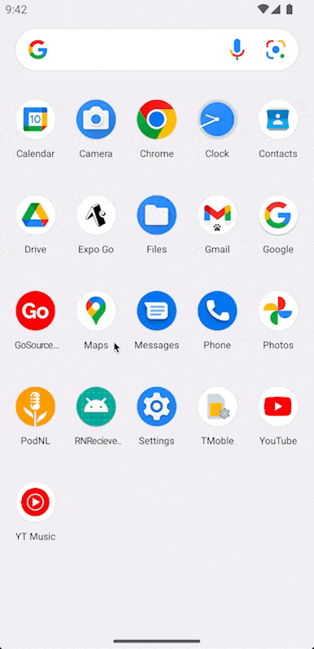

# React Native recieve share files tutorial

  
   
  
   
  
   
  

 
Tutorial video how to recieve files, images, videos, etc from ios/android share functionality inside your React Native application.

Video - https://youtu.be/MWokVi0tLV8

react-native-receive-sharing-intent library - https://github.com/ajith-ab/react-native-receive-sharing-intent

## 🎬 Demo

| Android |                   iOS                    | 
| :---: |:----------------------------------------:| 
| |  |

